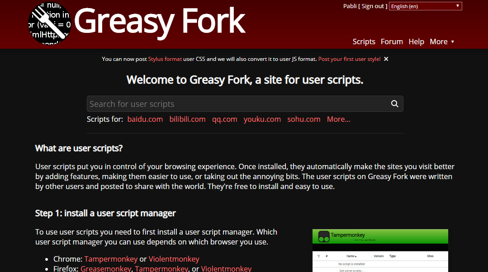

  <h1>GreasyFork - Dark Theme</h1>
  
    or
<a href="https://greasyfork.org/scripts/395180-greasyfork-dark-theme">GreasyFork</a>, 
<a href="https://userstyles.world/style/144/greasyfork-dark-theme">UserStyles.world</a>
 
(To install this style you need a <a href="https://github.com/openstyles/stylus#stylus">stylus extension</a>)

 

## License
[CC-BY-SA-4.0](https://github.com/pabli24/GreasyFork-Dark/blob/main/LICENSE)

## My other userstyles
 [GreasyFork](https://greasyfork.org/users/124677-pabli) |  [UserStyles.world](https://userstyles.world/user/pabli) | 
 [UserStyles.org Archive](https://uso.kkx.one/browse/styles?search=%40291236)

